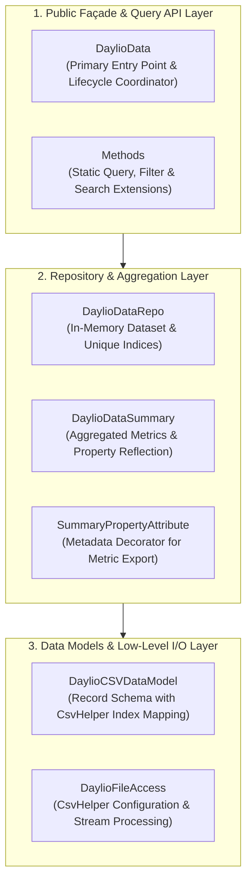

# DaylioData Architecture Overview

DaylioData is a lightweight .NET library designed to parse, index, and query exported Daylio CSV mood tracking and activity data.

---

## 3-Layer Architectural Design

The library is organized into three distinct layers:

---

## Architectural Layers Explained

### 1. Public Façade & Query API Layer
- **Components**: `DaylioData`, `DaylioData.Methods`.
- **Responsibilities**: Serves as the consumer-facing interface. Coordinates initialization of file access, in-memory repository, and summary analytics. Exposes query functions (`GetEntriesInRange`, `GetEntriesWithActivity`, `GetEntriesWithMood`, `GetActivityCount`, `GetEntriesWithString`).

### 2. Repository & Aggregation Layer
- **Components**: `DaylioDataRepo`, `DaylioDataSummary`, `SummaryPropertyAttribute`.
- **Responsibilities**: Manages the parsed in-memory collection of Daylio entries. Computes and indexes unique activities and moods. Produces summary statistics (total entries, total days, distinct activity counts, average entries per day, earliest/latest entries) via reflection on decorated summary properties.

### 3. Data Models & Low-Level I/O Layer
- **Components**: `DaylioCSVDataModel`, `DaylioFileAccess`, CsvHelper.
- **Responsibilities**: Defines the CSV schema mapping with positional indices (`[Index(n)]`), DateOnly and TimeOnly deserialization, header normalization (`snake_case` to PascalCase), and invariant culture stream handling.

---

## Key Invariants & Design Principles

1. **Culture Invariance**: All CSV reading and date/time parsing must specify `CultureInfo.InvariantCulture` to prevent locale-specific date and delimiter anomalies.
2. **Deterministic Resource Management**: File streams and `CsvReader` instances must always be wrapped in `using` blocks to prevent file locks.
3. **Defensive Null Handling**: Missing CSV values (notes, activities, custom moods) must be handled gracefully without throwing unhandled exceptions.
4. **Explicit Typing & Formatting**: All source files adhere to the `.editorconfig` rules, including Allman bracing, explicit variable types, and target-typed `new()`.
