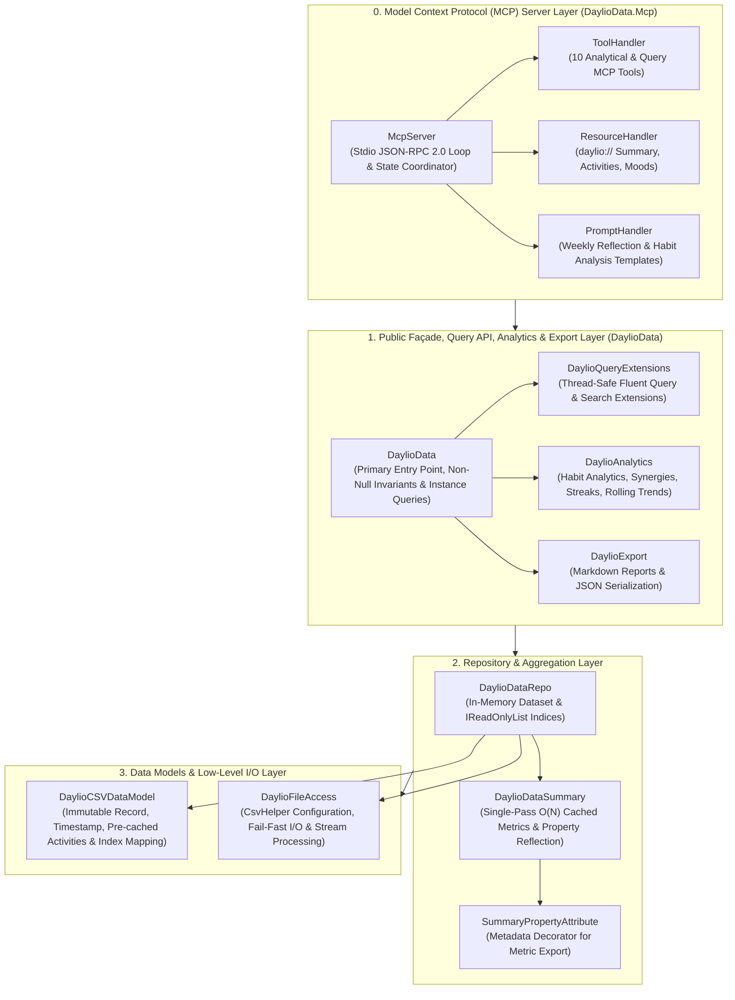

# DaylioData Architecture Overview

DaylioData is a .NET library and Model Context Protocol (MCP) server designed to parse, index, query, analyze, and expose exported Daylio CSV mood tracking and activity data.

---

## 4-Layer Architectural Design

The solution is organized into four distinct architectural layers:

---

## Architectural Layers Explained

### 0. Model Context Protocol (MCP) Server Layer (`DaylioData.Mcp`)
- **Components**: `McpServer`, `ToolHandler`, `ResourceHandler`, `PromptHandler`, `Program`.
- **Responsibilities**: Implements the Model Context Protocol over stdio using JSON-RPC 2.0. Serves AI agents (such as Claude Desktop, Cursor, and Antigravity) with 10 analytical tools, 3 resource endpoints (`daylio://summary`, `daylio://activities`, `daylio://moods`), and 2 guided prompt workflows. Packaged as a standalone .NET Global Tool (`daylio-mcp`).

### 1. Public Façade, Query API, Analytics & Export Layer (`DaylioData`)
- **Components**: `DaylioData`, `DaylioQueryExtensions`, `DaylioAnalytics`, `DaylioExport`.
- **Responsibilities**: Serves as the consumer-facing interface. Coordinates initialization with fail-fast constructors and non-throwing `TryLoad` / `TryLoadAsync` patterns. Exposes thread-safe instance query functions (`GetEntriesInRange`, `GetEntriesWithActivity`, `GetEntriesWithMood`, `GetActivityCount`, `GetEntriesWithString`), advanced habit analytics (`GetActivityMoodImpact`, `GetAllActivityMoodImpacts`, `GetTopActivityPairs`, `GetActivityPairImpact`, `GetAllActivityPairImpacts`, `GetMoodByTimeOfDay`, `GetStreakDetails`, `GetRollingMoodTrends`), and export formats (`GenerateMarkdownReport`, `ToJson`).

### 2. Repository & Aggregation Layer
- **Components**: `DaylioDataRepo`, `DaylioDataSummary`, `SummaryPropertyAttribute`.
- **Responsibilities**: Manages the parsed in-memory collection of Daylio entries as `IReadOnlyList<DaylioCSVDataModel>`. Computes and indexes unique activities and moods case-insensitively. Produces single-pass cached summary statistics (total entries, total days, distinct activity counts, average entries per day, earliest/latest entries by timestamp) via reflection on decorated summary properties with automated cache invalidation on repository updates.

### 3. Data Models & Low-Level I/O Layer
- **Components**: `DaylioCSVDataModel`, `DaylioFileAccess`, CsvHelper.
- **Responsibilities**: Defines the CSV schema mapping with positional indices (`[Index(n)]`), DateOnly and TimeOnly deserialization, combined `Timestamp` (`DateTime`), immutable record semantics, pre-cached `ActivitiesCollection`, header normalization (`snake_case` to PascalCase), and invariant culture stream/reader handling.

---

## Key Invariants & Design Principles

1. **Culture Invariance**: All CSV reading, date/time parsing, and metric number formatting must specify `CultureInfo.InvariantCulture` to prevent locale-specific date and delimiter anomalies.
2. **Deterministic Resource Management**: File streams and `CsvReader` instances must always be wrapped in `using` blocks to prevent file locks.
3. **Thread-Safe Façade & Invariants**: `DataRepo` and `DataSummary` are guaranteed non-null on initialized `DaylioData` instances. All query and analytics extension methods operate directly on the target instance without mutating static shared state.
4. **Non-Null Collection Guarantees**: Query and search methods never return null; empty queries yield `Array.Empty<DaylioCSVDataModel>()`.
5. **Clean Stdio Separation**: The MCP server strictly directs JSON-RPC protocol communication to standard output and diagnostic logging to standard error, ensuring protocol integrity.
6. **Explicit Typing & Formatting**: All source files adhere to repository standards, including Allman bracing, explicit variable types (no `var`), and target-typed `new()`.
